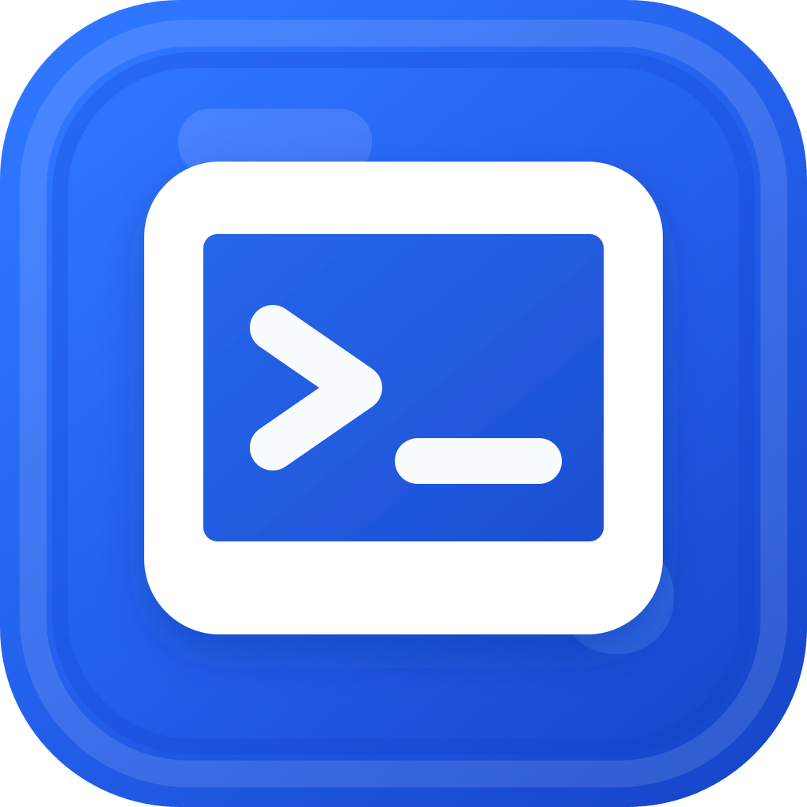
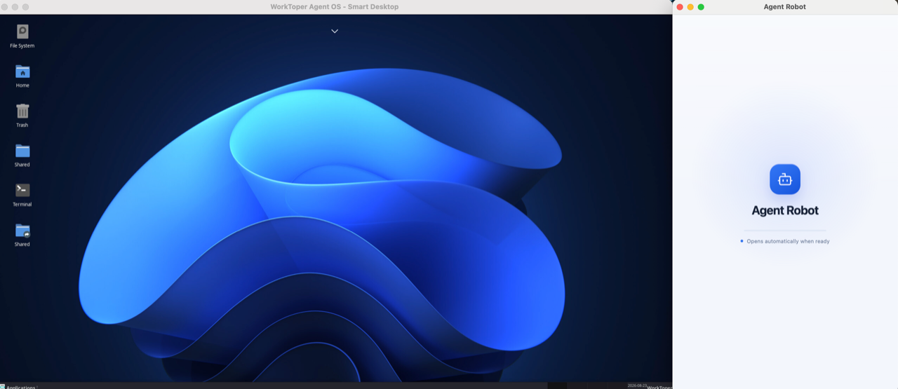
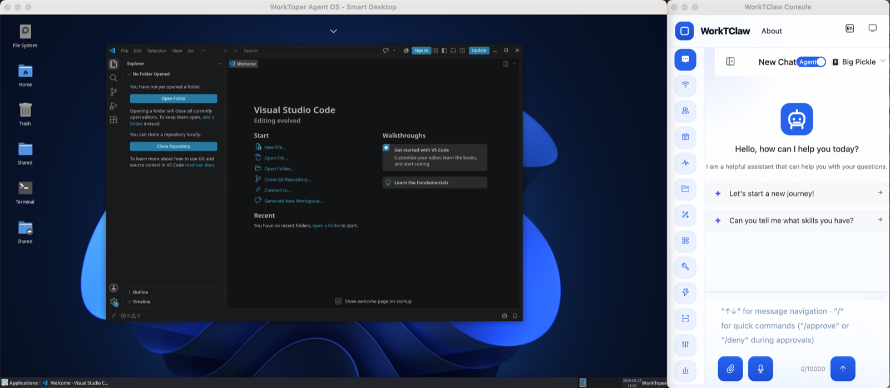

<div align="center">
  
  <h1>WorkToper Agent OS</h1>
  <p><strong>Work With AI Agent</strong></p>
  <p>把 AI Agent 带进一个真正可操作的 Linux 智能桌面。<br>开发、自动化与系统能力，在一个窗口里自然协作。</p>
  <p><em>Bring your AI Agent into a real, interactive Linux workspace.</em><br><em>Build, automate, and get things done in one desktop.</em></p>
  
</div>

[官网](https://www.worktoper.com/agent-os) · [下载](https://www.worktoper.com/agent-os/downloads?lang=en) · [English](README.md) · [MIT License](LICENSE)

## 中文

### 一个能一起工作的 AI 桌面

WorkToper Agent OS 把 AI Agent、Linux 环境和日常开发工具放进同一个桌面。你可以看到 Agent 正在做什么，也可以随时打开终端、编辑器或浏览器接管工作。

它适合那些希望拥有真实 Linux 能力、又不想切换宿主机或维护复杂远程环境的人：开箱即用，保持隔离，并且可以持续保存自己的工作空间。

发行包已经包含目标平台所需的 QEMU、固件、动态库和镜像解压工具。最终用户无需安装 QEMU、tar 或其他宿主机运行时依赖；首次打开应用时会自动下载并安装 Linux VM 镜像。

### 你可以用它做什么

- 在 macOS、Windows 或 Linux 上使用独立的 Debian 工作空间。
- 让 AI Agent 在可观察、可交互的 Linux 桌面中执行任务。
- 运行终端、Chromium、VSCodium 和其他 Linux GUI 应用。
- 使用 APT 安装软件，使用共享目录访问宿主机文件。
- 在宿主机与 Linux 桌面之间同步文字剪贴板。

### 智能桌面体验

启动日志、Linux 终端、图形桌面和 Agent Robot 都可以在应用中协同使用。桌面窗口支持键盘、鼠标、剪贴板和常见的开发工作流。

<div align="center">
  
</div>

### 核心技术

项目使用 Electron 作为桌面应用外壳，通过 QEMU 运行 Debian Linux VM，再用 noVNC 和 xterm.js 提供图形桌面与终端交互。QEMU Guest Agent 用于桌面集成和系统操作，VM 使用 qcow2 磁盘保存持久化环境。

```text
Electron → QEMU → Debian Linux VM
                    ├─ XFCE / x11vnc：图形桌面
                    ├─ noVNC：应用内显示
                    └─ xterm.js：启动日志与终端
```

### 快速开始

以下要求只用于从源码开发：Node.js 20+、Corepack、pnpm 10.15.0，以及 macOS x64、Windows x64 或 Linux x64。安装发行包的最终用户无需安装这些开发依赖。

```bash
corepack enable
corepack prepare pnpm@10.15.0 --activate
pnpm install
pnpm build
pnpm desktop:dev
```

如果还没有 VM 镜像，可以运行：

```bash
pnpm vm:prepare
```

### 构建发行包

```bash
pnpm dist:mac
pnpm dist:win
pnpm dist:linux
```

Linux 产物为 AppImage 和 deb；macOS 产物为 DMG 和 ZIP；Windows 产物为 NSIS 安装包和 portable 包。正式发布 macOS 应用时还需要签名和 notarization。

构建会在打包前和产物生成后校验内置 QEMU、固件、运行库与解压工具；任何目标平台运行时缺失都会直接终止构建。

### 项目结构

```text
app/                  Next.js 页面入口
components/web-os/    智能桌面 UI、终端和嵌入式桌面
desktop/              Electron 主进程、IPC 和 VM Manager
lib/                  前端运行时与 Electron bridge
scripts/              VM 镜像准备和运行时脚本
runtime/              QEMU、Electron 和平台运行时
docs/images/          README 截图
```

### 参与贡献

欢迎提交 Issue、改进文档、修复 bug 和贡献代码。提交前建议运行：

```bash
pnpm build
node --check desktop/vm-manager.cjs
git diff --check
```

### 开源协议

本项目源代码使用 [MIT License](LICENSE) 发布。
